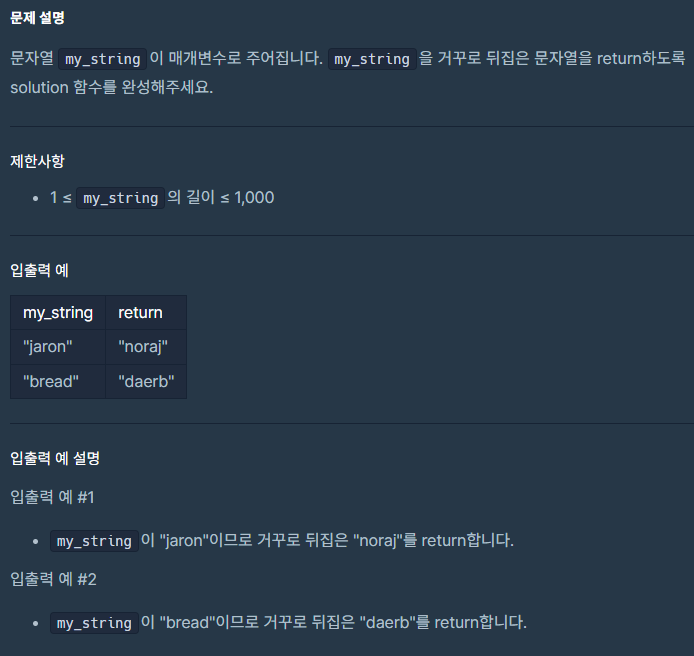

# 문자열 뒤집기 (feat.StringBuilder)

## 문제 설명




## 나의 풀이
```java

import java.util.Arrays;
class Solution {
    public String solution(String my_string) {
        String answer = "";
        char[] txt = my_string.toCharArray();
        for(int i = 0; i < txt.length; i ++){
            answer += txt[(txt.length - 1) - i];
        }
        return answer;
    }
}

```

## 다른 풀이방법

### StringBuilder 사용

#### Class StringBuilder <br>
java.lang.Object <br>
java.lang.StringBuilder

##### All Implemented Interfaces:
<dd><a href="../../java/io/Serializable.html" title="interface in java.io">Serializable</a>, <a href="../../java/lang/Appendable.html" title="interface in java.lang">Appendable</a>, <a href="../../java/lang/CharSequence.html" title="interface in java.lang">CharSequence</a></dd>

`StringBuilder`는 문자 시퀀스를 가변적으로 다룰 수 있는 클래스 입니다. 이 클래스는 `StringBuffer`와 API 호환성을 가지지만,
**동기화에 대한 보장은 제공되지 않습니다.** 즉 설계상 스레드 안전하지 않다는 것을 의미합니다. 여러 스레드가 `StringBuilder`를 동시에 사용하면 비정상적인 결과를 초래할 수 있습니다.
일반적으로 단일 스레드에서 사용되던 `StringBuffer`를 사용하던 자리에 `Drop-in Replacement`, 즉 별다른 코드수정 없이 사용할 수 있도록 설계되었습니다.
가능하다면, `StringBuffer` 대신 `StringBuilder`를 사용하는 것이 좋습니다. 이유는 `StringBuilder`가 `StringBuffer`보다 성능면에서 빠르기 때문입니다.

### String 과 StringBuilder의 차이점
String 은 고정된 길이의 불변(immutable)한 문자열입니다.
불변이므로 String 객체를 변경시 실제로 변경되는게 아니라 새로운 String 객체를 생성합니다. 변경하고 이전에 있던 객체는 JVM의 GC가 처리합니다.
반면에 StringBuffer와 StringBuilder는 가변(mutable)한 문자열입니다.
즉 String 처럼 새로운 객체가 생성되는게 아닌 객체 그 자체가 변경될 수 있습니다.
그러므로 문자열 변경이 잦은 작업이라면 String 대신 StringBuffer 또는 StringBuilder를 사용하는 것이 좋습니다.

정리하면
1. 문자열 변경이 빈번하지 않는다면 String 사용을 고려
2. 문자열이 빈번하게 변경되면서 멀티쓰레드 환경이라면 StringBuffer 사용을 고려
3. 문자열이 빈번하게 변경되면서 멀티쓰레드 환경이 아니라면 StringBuilder 사용을 고려


### 생성자
```java
// 기본 생성자
StringBuilder sb = new StringBuilder();
//int size 값을 인자로 하는 생성자, -> int type의 값으로 buffer의 사이즈(capacity)를 지정
StringBuilder sb = new StringBuilder(20);
//String type의 값을 인자로 하는 생성자, -> String type의 값을 buffer에 append
StringBuilder sb = new StringBuilder("Hello");
```

### 주요메소드

#### append
```java
public static void append(){
        /**
         * append() 메소드는 문자열을 뒤에 추가한다.
         * 메소드 체이닝으로 계속해서 추가할 수 있다.
         * 파라미터로 들어올 수 있는 타입은 char, int, long, float, double, boolean, char[], CharSequence 등이 있다.
         */
        StringBuilder sb = new StringBuilder("abc");
        sb.append(4).append("string");
        System.out.println(sb);


        /**
         * 1. append(CharSequence s, int start, int end)
         */

        StringBuilder sb2 = new StringBuilder();
        sb2.append("Hello").append(" World", 1, 5).append("!");
        System.out.println(sb2);
        // Hello World!

        /**
         * 2. append(char[] str, int offset, int len)
         */
        char[] charArray = {'H', 'e', 'l', 'l', 'o', ' ', 'W', 'o', 'r', 'l', 'd'};
        StringBuilder sb3 = new StringBuilder("Greeting: ");
        sb3.append(charArray, 6, 5); // charArray[6]부터 5개 문자를 추가
        System.out.println(sb3);
        // Greeting: World
}
```

문잘 뒤에 문자를 추가하는 메소드입니다. 다양한 타입의 파라미터를 지원하고 다음처럼 사용도 가능합니다.
1. append(CharSequence s, int start, int end) : CharSequence 타입의 문자열을 추가하는데, start부터 end까지의 문자열을 추가합니다.
2. append(char[] str, int offset, int len) : char[] 타입의 문자열을 추가하는데, offset부터 len까지의 문자열을 추가합니다.


#### insert(int offset, String str)
```java

//public StringBuilder insert(int offset, String str)

public static void insert(){
        StringBuilder sb = new StringBuilder("abc");
        sb.insert(2, "ccc");
        System.out.println(sb);
    }
```
offset 위치에 문자열을 추가합니다.


#### replace(int start, int end, String str)

```java

//public StringBuilder replace(int start, int end, String str)

public static void replace(){
        StringBuilder sb = new StringBuilder("abc");
        sb.replace(3, 6, "hi");
        System.out.println(sb);
}
```

start부터 end까지의 문자열을 str로 대체합니다.

#### String substring(int start)

```java
//public String substring(int start)

public static void substring(){
        StringBuilder sb = new StringBuilder("abc");
        sb.substring(3);
        System.out.println(sb);
}

```

start부터 끝까지의 문자열을 반환합니다.

#### char charAt(int index)

```java
public static void charAt(){
        StringBuilder sb = new StringBuilder("abc");
        sb.charAt(1);
        System.out.println(sb);
    }
```

index 위치의 문자 (`char`) 를 반환합니다.

#### StringBuilder deleteCharAt(int index)
    
```java
public static void deleteCharAt(){
        StringBuilder sb = new StringBuilder("abc");
        sb.deleteCharAt(1);
        System.out.println(sb);
    }
```

index 위치의 문자를 삭제합니다.

#### StringBuilder delete(int start, int end)

```java
public static void delete(){
        StringBuilder sb = new StringBuilder("abc");
        sb.delete(1, 2);
        System.out.println(sb);
    }
```

start부터 end까지의 문자열을 삭제합니다.

#### StringBuilder reverse()

```java
public static void reverse(){
        StringBuilder sb = new StringBuilder("abc");
        sb.reverse();
        System.out.println(sb);
    }
```

문자열을 뒤집습니다.

#### setCharAt(int index, char ch)
```java
public static void setCharAt(){
        StringBuilder sb = new StringBuilder("abc");
        sb.setCharAt(1, 'd');
        System.out.println(sb);
    }
```

index 위치의 문자를 ch로 대체합니다.

#### void setLength(int newLength)
```java
public static void setLength(){
        StringBuilder sb = new StringBuilder("abc");
        sb.setLength(5);
        System.out.println(sb);
    }
```

문자열의 길이를 newLength로 설정합니다.
원래 문자열보다 작은 길이로 설정하면 길이가 줄어들고, 길이가 더 길면 뒤에 공백이 추가됩니다.

#### void trimToSize()
```java
public static void trimToSize(){
        StringBuilder sb = new StringBuilder("abc");
        sb.trimToSize();
        System.out.println(sb);
    }
```

객체가 사용하는 내부 메모리의 크기를 현재 문자열의 실제 길이에 맞게 줄이는 작업을 수행합니다.
StringBuffer 또는 StringBuilder는 가변적이기 때문에 실제 문자열 길이에 비해 메모리가 과도하게 할당된 경우가 발생할 수 있습니다.


### 정리

StringBuilder는 문자열을 가변적으로 다룰 수 있는 클래스입니다. 
String과 달리 가변적이기 때문에 문자열을 변경할 때마다 새로운 객체를 생성하지 않아도 되기 때문에 성능상의 이점이 있습니다.
따라서 문자열을 자주 변경할 때는 StringBuilder를 사용하는 것이 좋습니다.

StringBuilder가 제공해주는 기능은 아래와 같습니다.
1. 문자뒤에 문자열 추가 : append()
2. 문자열 중간에 문자열 추가 : insert(CharSequence s, int start, int end)
3. 문자열 대체 : replace(int start, int end, String str)
4. offset 부터 문자열 자르기 : substring(int start)
5. 특정 위치의 문자 가져오기 : charAt(int index)
6. 문자열 길이 설정 : setLength(int newLength)
7. 문자열 뒤집기 : reverse()
8. 특정 위치의 문자열 삭제 : deleteCharAt(int index)
9. 특정 범위의 문자열 삭제 : delete(int start, int end)
10. 특정 위치의 문자 대체 : setCharAt(int index, char ch)
11. 버퍼의 크기를 문자열의 길이에 맞게 줄이기 : trimToSize()

[StringBuilder API](https://docs.oracle.com/javase/8/docs/api/?java/lang/StringBuilder.html)
